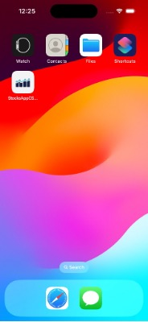
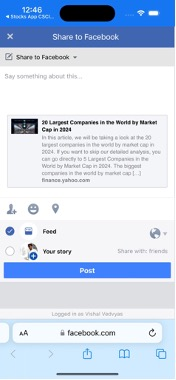
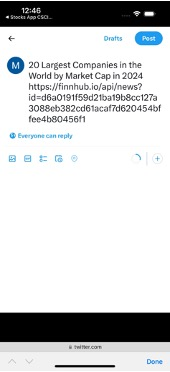

# 🍎 StockSearch-iOS

**Description:**  
StockSearch-iOS is a native iOS application built with **SwiftUI** and **WebKit**. It helps users track real-time stock information, manage a virtual stock portfolio, follow financial news, and analyze market trends. The app integrates with **Finnhub APIs** for live data and uses **MongoDB** for storing user data (favorites, portfolio, cash balance).

---

## Demo Video
- [Watch the Demo](https://drive.google.com/file/d/1RwTzVMQGPPdLmhJzjZISZDD7EmHEtHNV/view?usp=drive_link)

---

## Key Highlights

1. **SwiftUI 5 & MVVM:** Clean, declarative UI code and a scalable architecture.  
2. **Real-Time Data:** Fetches live quotes, news, and social sentiments via a Node.js backend.  
3. **Virtual Trading:** Simulates buying/selling stocks with a preset cash balance.  
4. **User-Friendly Features:** Customizable watchlist (Favorites), drag-and-drop reordering, and intuitive search.  
5. **Third-Party Libraries:**  
   - **Alamofire** for HTTP networking  
   - **SwiftyJSON** for JSON parsing  
   - **Kingfisher** for image downloading/caching  

---

## 1. Splash Screen & App Icon

When the user first launches the app, a **splash screen** is displayed, showcasing the app icon.

  
  

---

## 2. Home Screen

The **Home Screen** is divided into two major sections: **Portfolio** and **Favorites**.

### 2.1 Portfolio Section
- **Cash Balance**: Shows uninvested cash (initially \$25,000).  
- **Net Worth**: Sum of Cash Balance and total stock holdings.  
- **Portfolio Stocks**: List of owned stocks with symbol, market value, total shares, and price change details.

  
  
  

### 2.2 Favorites Section
- Displays a **watchlist** of user-favorite stocks.
- Shows **current price** and **price changes**, color-coded (green/red/gray).
- Allows **quick navigation** to detailed stock info.

  

### 2.3 Edit Mode & Deletions
Users can **edit** their watchlist or portfolio to reorder or delete entries:
- **Edit Mode** toggles the reordering handles and delete buttons.
- **Swipe to Delete** also supported on each row.

  
  

  
  

---

## 3. Search Functionality

A **search bar** at the top lets users look up stocks by symbol:
- **Autocomplete suggestions** appear as you type.
- Uses **debouncing** to reduce redundant backend calls.
- Redirects to the **Stock Details Screen** upon selecting a suggestion.

  

---

## 4. Detailed Stock Information

Upon tapping a stock in **Home** or **Search**, users see a **Stock Details Screen**:

### 4.1 Stock Overview
- **Logo**, **company name**, **current price**, and **price changes** (with color-coding).
- **Favorite Icon** to add/remove from watchlist (with toast messages).

### 4.2 Stats & About
- **Stats**: High, Low, Open, and Previous Close.
- **About**: IPO date, industry, company website (clickable link), and peer symbols (scrollable).

  

### 4.3 Charts (Hourly & Historical)
- Embedded **Highcharts** with **WKWebView** for interactive data visualization.
- **Hourly Chart** displays recent intraday trends.
- **Historical Chart** shows broader market history.

  
  

### 4.4 Insights: Social Sentiments, Recommendation Trends, EPS Surprises
- **Social Sentiments**: Insider or social media sentiment data.
- **Recommendation Trends**: Analyst recommendations over time.
- **Historical EPS Surprises**: Past earnings performance vs. estimates.

  
  
  

---

## 5. News Section

Displays news articles related to the chosen stock:
- **Large News Article** is shown as a featured item.
- **Small News Article** layout for the rest.

Clicking an article opens a **details sheet** with:
- Source, published date, title, and description.
- Link to open the full article in Safari.
- **Twitter** and **Facebook** buttons for sharing.

  
  

  
  
  

---

## 6. Portfolio Management & Trading

### 6.1 Portfolio Screen
- Shows **Stocks Owned** with average cost, total cost, market value, price changes.
- If **no stocks** are owned, displays a prompt message.

  
  

### 6.2 Trade Sheet
- Users can buy or sell shares via a **sheet** overlay.
- Validates:
  - Sufficient funds for buying.
  - Sufficient shares for selling.
  - Positive and valid input.

  
  

#### Trade Success Messages
- Different messages for **buy/sell** and single vs. multiple shares.

  
  

---

## 7. Fetching Data & Loading States

Whenever the app retrieves fresh data (e.g., on screen load), a **ProgressView** shows a "Fetching Data" message.

  

---

## Technologies & Architecture

- **SwiftUI 5** + **MVVM** for a clean, reactive UI  
- **Node.js** backend for API calls to Finnhub and MongoDB  
- **MongoDB** to store favorites, portfolio, and cash balance  
- **SF Symbols** for consistent iconography  

---

## Challenges Faced

1. **Asynchronous Data & Performance**  
   Used `@Published` properties, debouncing, and background threads to ensure smooth UI updates.

2. **WKWebView Integration**  
   Bridged SwiftUI and UIKit to embed **Highcharts** for hourly/historical stock data.

3. **Robust Error Handling**  
   Handled invalid inputs, insufficient funds/shares, and network errors without crashing.

---

## Conclusion

**StockSearch-iOS** showcases my ability to create a production-ready iOS application with SwiftUI, leveraging real-time data and user-focused features. It integrates a robust backend (Node.js & MongoDB), provides a smooth user experience (animations, error handling, and data caching), and supports essential stock-tracking functionalities.

Feel free to reach out if you have any questions or would like access to the source code:

**Contact:** [bafnashubham16@gmail.com](mailto:bafnashubham16@gmail.com)
